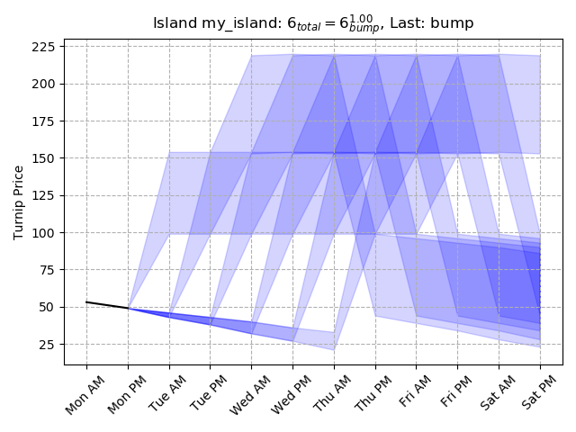
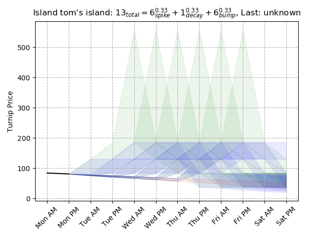
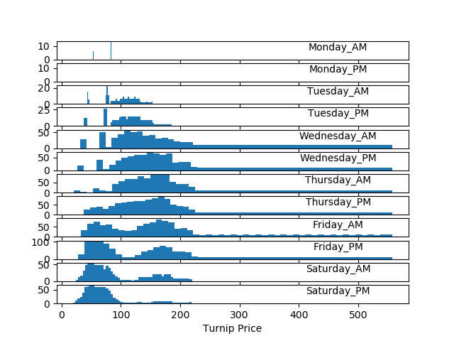

Turnips
=======

They are high in vitamin K.

What is this?
-------------

It's a Stalk Market price analysis library. If you give it the prices
observed on your island, it will help you predict your prices for the
rest of the week.

How?
----

Stalk Market prices in AC:NH are determined by four possible patterns
you can get for the week. Each pattern has a distinctive shape; by
entering in prices already seen, we can usually rule out many
possibilities.

In some cases, some patterns look too close to each other, though;
this happens often between a "Decay" week and a "Spike" week, which
can look identical until the spike happens.

How do I use this?
------------------

This is really meant as a library and not as an end-user tool, but
there is a little interface you can configure to see some graphs.

Look at `sample.yml
<https://gitlab.com/nanoNago/turnips/-/blob/master/sample.yml>`_ or
`sample.json
<https://gitlab.com/nanoNago/turnips/-/blob/master/sample.json>`_ --
both file formats work, use whichever format you are most comfortable
with.

Edit them to reflect your and your friends' islands as best as you are
able into a file named e.g. ``islands.json``

The json file should look like this::

  { "islands": {
      "my_island": {
        "initial_week": true,
        "timeline": {
          "Sunday_AM": 110,
          "Monday_AM": 53,
          "Monday_PM": 49
        }
      },
      "tom's island": {
        "previous_week": "bump",
        "timeline": {
          "Sunday_AM": 93,
          "Monday_AM": 84,
          "Monday_PM": 81
        }
      }
    }
  }

Some notes on this format:

- Set "initial_week" to true if the owner of that island has purchased
  turnips on their own island for the first time that week. This
  forces a BumpModel week, but obscures your buy price.

- Set "previous_week" to the name of the kind of week you had last
  week: "Bump", "Spike", "Decay", "Triple". This will adjust the
  statistics to show you the most likely week you're having now.

- Use "Sunday_AM" to set the purchase price on your island, NOT the
  price you purchased your turnips at. (e.g., not your friend's
  island's prices.)

When you're good and ready, you can run ``turnips --plot islands.json`` from
the command line to see a multi-group probability report and forecast.

You can look at `sample.txt
<https://gitlab.com/nanoNago/turnips/-/blob/master/sample.txt>`_ in
the repo for an example of what the multi-island forecast looks like
via text. Notably, each island gets:

- A list of possible models that island is following, grouped by model
  type. (Triple, Spike, Decay, Bump)

  - If a model group has only one viable model left, that model is
    printed without odds.

  - If a model group has several models left, a summary is printed for
    just that model group.

- If an island has at least two models left in any category, a summary
  is printed for that island.

- A summary is printed in aggregate for all the islands, giving your
  friend group an idea of what prices they can expect for the week.

Graphs
------

If you use ``--plot``, you'll also see some graphs and charts that help
illustrate your Stalk Market Futures.

	    Turnip forecast for "my_island", from sample.json

	    Turnip forecast for "tom's island", from sample.json

	    Turnip price forecast for both me and tom, from sample.json

Developer Info
--------------

The core of this library are "Models", each Model is a blueprint for
the type of week you can have. You can create model groups, like
`SpikeModels` or `TripleModels` which collect blueprints for those
types of weeks in particular.

At the top is the `MetaModel`, which collects every last kind of week
you can possibly have.

The library can be used by creating a MetaModel() object, like this:

``>>> prices = turnips.meta.MetaModel.blank()``

then you can get a report:

``>>> prices.report()``

Or just the probability for the week:

``>>> prices.summary()``

If you know what price was being offered on your island *and you did
not buy turnips from Daisy Mae for the first time*, you can narrow
down the possibilities:

``>>> prices = turnips.meta.MetaModel.blank(98)``

To start entering prices, start at Monday_AM whenever possible, and then:

- ``>>> prices.fix_price('Monday_AM', 53)``
- ``>>> prices.fix_price('Monday_PM', 49)``

or, you can use numerical digits to represent the timeslots; this is equivalent:

- ``>>> prices.fix_price(2, 53)``
- ``>>> prices.fix_price(3, 49)``

For more advanced usages, take a look at ``archipelago.py`` which has
``Archipelago`` and ``Island`` classes that aggregate information for a
group of islands (you and your friends) or the data for a single
island (you) and can help print graphs and forecasts.
